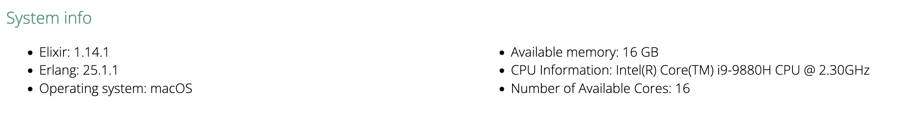
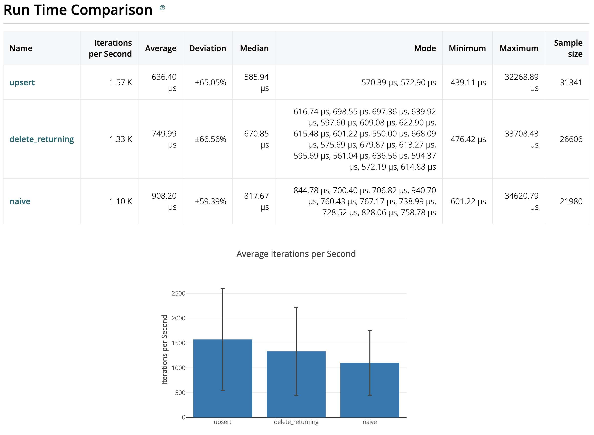
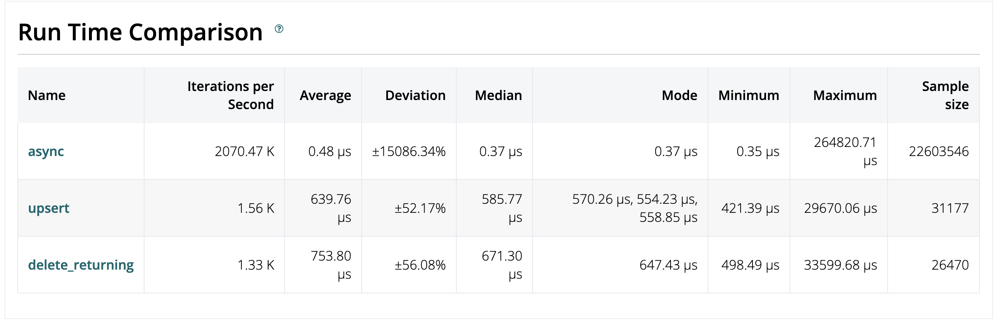

# Design

Some considerations:

- I am using phoenix since it is the facto library for web services in Elixir
- I use Postgres as a persistent DB since it is easiest choice

## First Steps

Since I am using Postgres first I wanted to do some tests about how the DB behaves with a pure counter. For this I created three strategies:

- naive (see module [Naive](./lib/pinocchio_nose/counters/strategy/naive.ex)): This opens a DB transaction, retrieves the counter and updates it. Of course this strategy is discarded but I wanted to run some benchmarking from here.
- SQL delete returning (see module [SQLDeleteReturning](./lib/pinocchio_nose/counters/strategy/sql_delete_returning.ex)): Here I am exploring an idea I found on internet which basically says inserts are cheaper than updates, so lets try to delete the row and insert it again with the counter updated!
- SQL Upsert (see module [SQLUpsert](./lib/pinocchio_nose/counters/strategy/sql_upsert.ex)): Here I am doing an upsert at DB level, using `INSERT` and `ON CONFLICT` sql clauses.

*NOTE*: I think I didn't get the best from Delete Returning strategy and probably can be improved.

With this in mind I run some benchmarks using [Benchee](https://hexdocs.pm/benchee/readme.html). See [sync strategies benchmark file](./benchmarks/sync_strategies_benchmark.exs)




as expected, the Naive strategy is the slowest one. The upsert strategy is 50% faster than the naive one. That is good but not amazing. At this point I discarded having a full consistent solution and decided to implement an eventual consistent approach.

## Buffer

In order to avoid hitting the DB every single increment and reduce data contention I decided to use an ETS table and take advantage of the built in `update_counter` function, which is atomic and highly performant.

An ETS table has to be linked to an Erlang/Elixir process. So I created a simple GenServer ([Buffer](./lib/pinocchio_nose/counters/buffer.ex)). This GenServer is very simple and only has 2 missions:

- Create the ETS as a public table, handling concurrent writes.
- Run a job every X seconds (5 seconds by default)

This GenServer module has a function called `increment/2`. This function has the logic to increment a counter in the DB but **this function is executed in the caller process not the gen_server itself, so no bottleneck issues**.

With this in mind, every time we try to increment a counter the ETS is incremented and after X seconds the gen server flushes the ETS table and bulks data to the DB. After some local tests I saw that this approach can handle ~2 million operations per second.

Lets see some benchmarking. See [strategies benchmark file](./benchmarks/strategies_benchmark.exs)




Those numbers look pretty decent for a prototype, so I finished the research here. But first we need to confirm the storage is eventually consistent. For that I wrote a simple test (see [this file](./benchmarks/async_test.exs)). This is not using Benchee but is calling 10 million times the increment function with a value of 2. So after that I wait 6 seconds (remember the sync period in the buffer is 5 seconds by default) and then I retrieve the counter from the DB and check the value.

```
Number of operations: 10000000
Expected result: 20000000
final counter value: 20000000
```

## Extra functionalities

- I have added a Rate limiter using existing [hammer_plug](https://hexdocs.pm/hammer_plug/overview.html) library. I set it to allow 2 requests per 5 seconds. Totally random numbers but just to be easy for testing manually with curl/postman.
- I added some metrics using the standar `telemetry` library and `Telemetry.Metrics`. I send those metrics to the existing liveview dashboard in phoenix. You can see it [here](http://localhost:3333/dashboard/metrics?nav=pinocchio_nose) once the project is up and running
- For benchmarking I used Benchee. You can see a couple of scripts on `benchmarks/` folder. In order to run them you have to run:

```
mix run benchmarks/name_of_the_script.exs
```

## Further steps

This prototype can scale horizontally pretty well but if we get the demand growing the first problem we will have would be the centralized Postgres DB. In that case we would explore another fixes like scaling out Postgress or using techniques like sharding. But, honestly, if we have this requirement (implement a counter) in the real world and our current tech stack is not able to handle it easily I would explore another solutions before implement this prototype, for example using Redis and taking advantage of the built in INCR function.

# Endpoints
### Increment endpoint

```
curl -iX POST 'http://localhost:3333/api/v1/increment' \
  -H 'content-type: application/json' \
  -d '{"key": "key1", "value": 3}'
```

### Get counter endpoint

```
curl 'http://localhost:3333/api/v1/increment/key1'
```

# Run the server

```
iex -S mix phx.server
```

This will start our server in localhost:3333

# Testing

In order to run tests you run
```
mix test
```

I also provided a more extended function

```
mix check
```

This add aditional checks like code format, credo, coverage and dialyzer. This function takes some time the first time we run it since the Dialyzer's PLTs has to be built.


